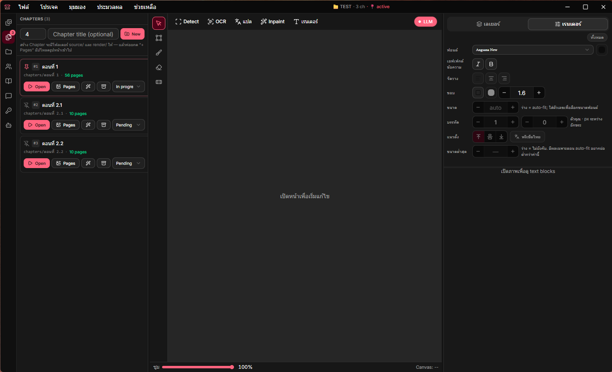

# Koharu-TH

[](https://github.com/EarthWL/koharu-th/releases)
[](LICENSE-GPL)
[](LICENSE-APACHE)
[](https://github.com/mayocream/koharu)
[](https://github.com/mayocream/koharu/releases)
[](https://www.rust-lang.org/)

> [English](./README.md)
>
> **Manga series-translation studio** — fork ที่แยกทางจาก
> [mayocream/koharu](https://github.com/mayocream/koharu) มาจาก
> source point เดียวกัน (0.37.0) แต่ไปคนละทิศทาง เราเพิ่ม SQLite
> ต่อ project (characters / glossary / TM / prompt templates /
> cost log), ระบบ LLM Profile 5 provider, AI Chat agentic ที่ดึง
> ข้อมูลจาก wiki URL เข้าโปรเจคได้, และ MCP server ~60 tools
> สำหรับ external agents. Versioning แยกอิสระ (1.x.x); เรา cherry-
> pick bug fix จาก upstream แบบเลือก ๆ ดูส่วน
> [เรามาถึงจุดนี้ได้ยังไง](#เรามาถึงจุดนี้ได้ยังไง-และ-upstream-ไปทางไหน)
> ด้านล่างสำหรับเรื่องเล่าการ diverge

โปรแกรมแปลมังงะด้วย ML เขียนด้วย **Rust**

ภายในใช้ [candle](https://github.com/huggingface/candle) สำหรับ ML inference ความเร็วสูง และ [Tauri](https://github.com/tauri-apps/tauri) สำหรับ GUI ทุกส่วน native เขียนด้วย Rust

> [!NOTE]
> Koharu รัน ML models บน **เครื่อง local** เป็นค่าเริ่มต้น ถ้าคุณบันทึก Cloud LLM Profile แล้วกด Apply (OpenAI / Claude / Gemini / OpenRouter / Local LLM server) ข้อความที่แปลจะถูกส่งไป provider นั้น — ส่วนอื่นยังรันบนเครื่องอยู่ ต้อง opt-in ผ่าน Profiles sidebar tab เท่านั้น

---



## เรามาถึงจุดนี้ได้ยังไง และ upstream ไปทางไหน

Fork นี้เริ่มจาก patch ภาษาไทยของ upstream **koharu 0.37.0**
(มีนาคม 2026) ตั้งแต่นั้นมาทั้งสองโปรเจคออก release ใหญ่ทั้งคู่ ไป
คนละ roadmap ประวัติ git ไม่ได้ merge กัน — fork ทำโดย squash
source ของ 0.37.0 เป็น import commit เดียว ไม่ใช่ `git fork` ดังนั้น
`git diff` ตรง ๆ ไม่มีความหมาย จุดที่สำคัญคือรูปร่างของ product
ที่แยกออกจากกัน

**Upstream** เดินทาง 0.37.0 → 0.59.x ใน **22 minor releases + 485
commits** มุ่งเป็น general manga translator ที่เร็วและรองรับกว้าง:
แทนที่ candle ด้วย llama.cpp สำหรับ LLM inference, รองรับ AMD GPU
ผ่าน ZLUDA, Vulkan backend สำหรับ non-NVIDIA, single-binary CUDA
ผ่าน PTX-JIT, OCR / inpaint models ใหม่ (`paddleocr-vl-1.5`,
`manga-text-segmentation-2025`, AOT inpaint, Flux.2 Klein), Codex
img2img สร้างหน้าใหม่จากต้นฉบับ + prompt, layered PSD export, CLI
regression-test pipeline, in-app updater, MT providers เพิ่ม
(DeepL / Google / Caiyun), font weight/style picker, และ locale
ใหม่ 9+ ภาษา (KO / BE / BG / PT / TR / …)

**Fork ฝั่งนี้** ไปอีกทาง — เป็น **localization studio ต่อ series
ที่มี memory ของโปรเจค**: SQLite เก็บ glossary / character roster /
translation memory (exact + Jaccard + semantic embeddings + TMX 1.4
interchange) / prompt templates / cost log แยกต่อโปรเจค, AI Chat
แบบ agentic ที่ดึงข้อมูลจาก wiki URL ใส่ลง project ได้, QC ตอนเพื่อ
หาความไม่สอดคล้อง, หรือ apply การแก้สะกด/ไวยากรณ์ไทย, CBZ
multi-chapter export พร้อม `ComicInfo.xml`, renderer ที่เข้าใจไทย
(line-height, letter-spacing, min-font-size, vertical-align, หมุน
text block, เตือน overflow/tight, ขั้น post-process ไทย), และ MCP
server ~60 tools สำหรับ external agents 169 commits, 6 releases
(1.0.0 → 1.2.0)

Roadmap ของทั้งสองไม่ทับกันแล้ว **เลือก upstream** ถ้าต้องการ ML
pipeline ที่เร็วที่สุดบน GPU หลายแบบ และรองรับหลายภาษา
**เลือก fork นี้** ถ้าต้องการ workflow tool ที่จำชื่อตัวละครและ
glossary ข้ามตอนได้ — โดยเฉพาะถ้าผลลัพธ์เป็นภาษาไทย

เรายัง cherry-pick bug fix จาก upstream เฉพาะที่กระทบโค้ดร่วมกัน
(ดูส่วน [Syncing with upstream](#syncing-with-upstream)) และ
roadmap 1.3.x ตั้งใจ sync backend ของ upstream (PTX-JIT / Vulkan /
ZLUDA) เพื่อจะได้ ship installer เดียวแทนที่จะเป็น 4 ตัว

## สิ่งที่ต่างจาก upstream

เทียบ **upstream ปัจจุบัน (0.59.x)** กับ **fork (1.2.0)** —
ไม่ใช่การข่ม ทั้งสองเป็นโปรเจคที่ดี เพียงแต่กลุ่มเป้าหมายต่างกัน

| มิติ | Upstream 0.59.x | Koharu-TH 1.2.0 |
|---|---|---|
| Project model | เปิดไฟล์ / `.khr` | **Series Project ต่อ folder** พร้อม SQLite (11 tables) |
| Workflow scope | per-page detect → OCR → inpaint → แปล → render | **per-chapter พร้อม rolling-context summary จากตอนก่อนหน้า** |
| LLM backends | **llama.cpp** local + multi-preset cloud (OpenAI / Claude / Gemini / DeepL / Google / Caiyun) | candle local + **5 cloud profile types** (OpenAI / Claude / Gemini / OpenRouter / Local LLM server) — ต่อ project, live model search, ราคา per-1M |
| Translation memory | — | exact / Jaccard / **semantic (vector embeddings)** + TMX 1.4 import/export |
| AI assistant | custom system prompt | **agentic AI Chat** — 20 tools + 10 slash commands, function-calling 4 providers, แนบรูป, MCP ~60 tools สำหรับ external agents |
| Glossary / Characters | — | **ต่อ project, smart-filter ฉีดเข้า prompt แปล** |
| Export | single page · **layered PSD** | **CBZ multi-chapter** พร้อม `ComicInfo.xml` |
| Cost tracking | — | log ต่อ call + **dashboard** (by profile / chapter / day / use case) |
| Power-user | **keybind config**, **multi-selection**, **redo/undo** | **⌘K command palette** — jump chapter / profile / export / slash |
| Renderer | CJK + **font weights/styles**, **LTR/RTL reading order** | + **Thai-aware fonts**, หมุน text block, line-height / letter-spacing / vertical-align / min-font-size, **เตือน overflow**, **ขั้น post-process ไทย** |
| GPU support | **Vulkan + ZLUDA (AMD) + CUDA PTX-JIT single binary** | CUDA per-GPU binaries (Turing / Ampere / Ada / Blackwell) + Metal — ZLUDA / Vulkan / PTX-JIT ตั้งใจทำใน 1.3.x |
| OCR models | **paddleocr-vl-1.5, manga-text-segmentation-2025, pp-doclayout-v3** | MIT-48px (Latin / CJK / Thai) + manga-ocr (JP) + Anime Text YOLO (1.1.x) · models ของ upstream ติดตามเพื่อ backport |
| Inpainting | **Flux.2 Klein, AOT, bubble-aware** | LaMa (สืบทอดจาก 0.37.0) · models ของ upstream ติดตาม |
| Image-to-image | **Codex img2img** สร้างหน้าใหม่ | — |
| Locales | EN / JA / ZH-CN / ZH-TW / KO / RU / ES / BE / BG / PT / TR / FR / DE / IT / VI / TH | **EN / TH / JA** ครบ + a11y pass (1.2.0); อื่น ๆ มีแต่ partial |
| In-app updater | **มี** | — (ดาวน์โหลดจาก Releases page เอง) |
| Telemetry | **Sentry** | ไม่มี |
| CI/CD | GitHub Actions matrix เต็ม | ปิดบน fork (macOS minutes แพง 10× ต่อชั่วโมง; รอ PTX-JIT sync ก่อน) |
| Versioning | continuous 0.x.x | **semver แยกอิสระ** 1.x.x |

## ฟีเจอร์หลัก

> ดูสรุปฟีเจอร์ทั้งหมดแบบกระชับใน [FEATURES.md](FEATURES.md) ส่วนด้านล่างเจาะลึกอันใหญ่ๆ

### Series Project (workspace ต่อ folder)

แต่ละเรื่องที่แปลเป็น **project folder** มี SQLite database ของตัวเอง — prompt แปลจะ assemble context จาก database นี้ทุกครั้ง ทำให้ชื่อตัวละคร / ชื่อท่า / คำลงท้าย / โทน คงเส้นคงวาตลอดทุก chapter

```
MyManga/
├── series.koharuproj          # manifest (JSON เล็กๆ)
├── series.db                  # SQLite — characters, glossary, TM, prompts, profiles, cost log, chat
├── chapters/
│   ├── ch01/
│   │   ├── source/            # ไฟล์ต้นฉบับที่นำเข้า (.png / .jpg / .khr)
│   │   └── render/            # ไฟล์ render สุดท้าย
│   └── ch02/...
└── reference/  assets/  export/
```

เปิด **Welcome screen** (auto ตอนเปิดแอป) → **New Project** → กรอก series metadata → สร้าง chapter → import รูป → แปล หรือ **Open** project ที่มีอยู่

### Cloud LLM Profiles

LLM provider config ทั้งหมดอยู่ใน **Profiles sidebar tab** (ไม่ใช่ใน Settings) บันทึก profile หลายตัวได้ สลับใช้คลิกเดียว

| Provider | Model list | หมายเหตุ |
|---|---|---|
| **OpenAI** | live `/v1/models` กรอง chat models | แก้ base URL เพื่อใช้ OpenAI-compatible (Together, DeepSeek, vLLM, …) ได้ |
| **Claude** | live `/v1/models` (anthropic-version + dangerous-direct-browser-access) | claude-3.5 / 4 / 4.5 series |
| **Gemini** | live `/v1beta/models` กรองเฉพาะ `generateContent` | แสดง token limits |
| **OpenRouter** | live `/v1/models` browse ได้โดยไม่ต้องมี key | แสดงราคา + context length ต่อ model |
| **Local LLM** | `/api/tags` (Ollama) หรือ `/v1/models` (LM Studio / llama.cpp) | ไม่ต้องมี key, auto-detect จาก URL suffix |

Model picker ทุกตัวค้นได้ — พิมพ์ส่วนใดของ model id ก็เจอ API keys เก็บใน **OS keyring** (ไม่ได้เก็บใน DB)

**LLM badge** บน Toolbar ใช้เลือก profile ที่ active ได้โดยไม่ต้องออกจาก canvas

### AI Chat (agentic, multi-modal, streaming)

Sidebar tab ที่คุยกับ **active profile** ผ่าน native function-calling รองรับทั้ง 4 cloud providers มี tools สำหรับทุก project entity (series_meta / chapters / characters / glossary / TM / prompt_render) บวก server-side `web_fetch_url` ที่ bypass browser CORS

- **Streaming responses** + ปุ่ม Stop — token ไหลออกมาทันที (OpenAI / OpenRouter / Local SSE · Anthropic content_block_delta · Gemini :streamGenerateContent)
- **แนบรูป** — แนบหน้า canvas ปัจจุบัน (1 คลิก) หรือ upload รูปจากเครื่อง auto-downsize ≤1024px JPEG q85 ก่อนส่ง ส่งเป็น multi-modal blocks ไปทุก provider, เก็บค้างใน chat history

**Slash commands** (autocomplete กด `/`):
- `/fetch-wiki <url>` — ดึงหน้า Fandom/wiki, เสนอ update synopsis + characters + glossary
- `/draft-synopsis`, `/draft-style-notes` — brainstorm context fields
- `/suggest-character <name>` — เสนอ Thai name / speech style / role
- `/extract-glossary <text>` — ดึง terms จาก source text
- `/summarize-chapter [id]` — สร้าง chapter summary (ป้อน rolling context)
- `/preview-prompt <text>` — แสดง prompt จริงที่ใช้แปล
- `/qc-consistency` — scan chapter ที่เปิดอยู่หา glossary/character mismatches แล้วเสนอวิธีแก้
- `/tm-semantic <text>` — semantic TM lookup ผ่าน embeddings (เจอ paraphrase)
- `/check-thai` — รีวิวภาษาไทย: สะกด/grammar/naturalness + apply fixes อัตโนมัติ

Chat history เก็บต่อ project ใน `series.db` (`chat_messages` table) panel แสดง 50 messages ล่าสุด + page back ได้

### Command palette (Cmd+K)

⌘K / Ctrl+K เปิด palette global — jump ไป chapter, สลับ profile, export CBZ, เปิด settings, copy slash command ลง chat input

### Prompt template engine

Prompt แปลเป็น **Handlebars templates** render ตอน call จริงพร้อม:

- `{{series_title}}`, `{{series_synopsis}}`, `{{genre}}`, `{{target_audience}}`
- `{{tone}}`, `{{formality}}`, `{{style_notes}}`
- `{{source_language}}` → `{{target_language}}`
- `{{characters}}` — ตัวละครหลัก (aliases, speech style, role)
- `{{glossary_entries}}` — **smart-filter** เฉพาะคำที่อยู่ใน source text ตอนนี้
- `{{rolling_summary}}` — auto-fetch summary ของ N chapters ก่อนหน้า (default 2)
- `{{source}}` — text block ที่กำลังแปล

แก้ template ที่ **Prompts tab** มี default template สำหรับ use cases: `translate`, `extract_entities`, `summarize_chapter`

### Translation memory

- **Exact-match** + **Jaccard fuzzy** (threshold ปรับได้, default 0.85)
- **Semantic / vector search** ผ่าน embeddings (cosine similarity, top-K) — เจอ paraphrase ที่ fuzzy match พลาด ปุ่ม backfill ใน Project tab เพื่อ embed entries เดิมด้วย active profile (`text-embedding-3-small` บน OpenAI-compat, `text-embedding-004` บน Gemini)
- เจอ TM = ข้าม cloud call
- **TMX 1.4 import / export** — ใช้ TM ร่วมกับ Trados / OmegaT / MemoQ / CAT tool อื่น

### Cost tracking + dashboard

- ทุก LLM call log ใน `llm_call_log` พร้อม token counts, duration, success/failure, estimated USD cost
- **Dashboard ใน Project sidebar tab**: headline spend / call / token stats + bar charts (30 วันล่าสุด, by profile, by chapter, by use case) ตั้ง per-1M pricing บนแต่ละ profile ได้ตัวเลข $ แม่นยำ

### Multi-chapter export

- **CBZ export** ต่อ chapter พร้อม `ComicInfo.xml` sidecar (Kavita / Komga / YACReader / mobile reader) ใช้รูปจาก `<chapter>/render/` ถ้ามี, fallback ไป `source/` กดปุ่ม archive ที่ chapter row หรือผ่าน Cmd+K palette

### Quality control

- **Bubble-fit warnings** — text-block panel แสดง badge สี amber `TIGHT` / rose `OVERFLOW` เมื่อ translation มีโอกาสล้นฟอง (heuristic: chars × estimated 18pt glyph area เทียบ bubble area + Thai/source length ratio)
- **Consistency checker** — `/qc-consistency` slash scan ทุก translated block เทียบ glossary + character names (รวม aliases) แสดง mismatches เป็นตาราง + เสนอแก้ผ่าน `update_text_block` หลัง approve

### ฟีเจอร์ renderer ที่เพิ่มสำหรับไทย

- Thai-aware font fallback (Leelawadee UI / Tahoma / Thonburi / Noto Sans Thai ตาม OS)
- Per-block controls: **line-height**, **letter-spacing**, **min font size** (auto-fit floor), **vertical-align**, **manual font size**, **Thai preset** button
- **Text-block rotation** (`rotation_deg`) สำหรับฟองไม่เป็นสี่เหลี่ยม + SFX แบบมีสไตล์

### MCP server (สำหรับ external agents)

~60 tools ที่ `/mcp` ครอบคลุม project ทั้งหมด — project lifecycle, chapters, characters, glossary, prompt rendering, translation memory, provider profiles, LLM cost log, รวมถึง agentic `web_fetch_url` External agent (Claude Desktop, Cursor, ฯลฯ) ทำ workflow **Project → Chapters → Glossary → Translate → TM** ได้ครบโดยไม่ต้องเปิด GUI

```bash
koharu --port 9999       # macOS / Linux
koharu.exe --port 9999   # Windows
```

ชี้ MCP-capable client ไปที่ `http://localhost:9999/mcp`

## การใช้งาน

### Hot keys

- <kbd>Ctrl</kbd> + Mouse Wheel: Zoom in/out
- <kbd>Ctrl</kbd> + Drag: Pan canvas
- <kbd>Del</kbd>: ลบ text block ที่เลือก
- <kbd>⌘</kbd>/<kbd>Ctrl</kbd> + <kbd>K</kbd>: เปิด command palette

### Headless mode

```bash
koharu --port 4000 --headless        # macOS / Linux
koharu.exe --port 4000 --headless    # Windows
```

Web UI ที่ `http://localhost:4000` MCP server ยัง serve ที่ `/mcp`

### File association

บน Windows ไฟล์ `.khr` จะ associate กับ Koharu อัตโนมัติ — double-click เปิดในโหมด standalone (ไม่ต้องมี project)

### Bundled fonts

Koharu-TH สร้าง `<app-data>/Koharu/fonts/` ตอนเปิดครั้งแรก (Windows: `%LOCALAPPDATA%\Koharu\fonts`, macOS: `~/Library/Application Support/Koharu/fonts`, Linux: `~/.local/share/Koharu/fonts`) วางไฟล์ `.ttf` / `.otf` / `.ttc` ลงไป → register พร้อม system fonts ตอนเปิดครั้งต่อไป มีประโยชน์สำหรับ Thai (เช่น [Noto Sans Thai](https://fonts.google.com/noto/specimen/Noto+Sans+Thai))

## GPU acceleration

รองรับ CUDA และ Metal

### CUDA

Koharu bundle CUDA toolkit 13.1 + cuDNN 9.19; dylibs ถูก extract ไป application data directory ตอนเปิดครั้งแรกอัตโนมัติ

> [!NOTE]
> ตรวจสอบให้แน่ใจว่า NVIDIA driver ล่าสุดติดตั้งแล้วผ่าน [NVIDIA App](https://www.nvidia.com/en-us/software/nvidia-app/)

รองรับ: NVIDIA GPU compute capability **7.5 ขึ้นไป** ดู [CUDA GPU Compute Capability](https://developer.nvidia.com/cuda-gpus) และ [cuDNN Support Matrix](https://docs.nvidia.com/deeplearning/cudnn/backend/latest/reference/support-matrix.html)

### Metal

รองรับบน macOS Apple Silicon (M1, M2, ฯลฯ)

### CPU fallback

บังคับใช้ CPU:

```bash
koharu --cpu       # macOS / Linux
koharu.exe --cpu   # Windows
```

## ML Models

### Computer Vision Models

- [comic-text-detector](https://github.com/dmMaze/comic-text-detector)
- [manga-ocr](https://github.com/kha-white/manga-ocr)
- [AnimeMangaInpainting](https://huggingface.co/dreMaz/AnimeMangaInpainting)
- [YuzuMarker.FontDetection](https://github.com/JeffersonQin/YuzuMarker.FontDetection)

Models ดาวน์โหลดอัตโนมัติตอนเปิดครั้งแรก Safetensors weights host ที่ [Hugging Face](https://huggingface.co/mayocream)

### Local LLMs

Koharu รองรับ quantized LLMs format GGUF ผ่าน [candle](https://github.com/huggingface/candle) เลือก preselect ตาม system locale

**English:**

- [vntl-llama3-8b-v2](https://huggingface.co/lmg-anon/vntl-llama3-8b-v2-gguf) — ~8.5 GB Q8_0, ต้อง ≥10 GB VRAM; ดีสุดเมื่อต้องการความแม่นยำ
- [lfm2-350m-enjp-mt](https://huggingface.co/LiquidAI/LFM2-350M-ENJP-MT-GGUF) — เบามาก (~350M Q8_0); รันบน CPU / GPU low-memory ได้

**Chinese:**

- [sakura-galtransl-7b-v3.7](https://huggingface.co/SakuraLLM/Sakura-GalTransl-7B-v3.7) — ~6.3 GB, ลง 8 GB VRAM ได้
- [sakura-1.5b-qwen2.5-v1.0](https://huggingface.co/shing3232/Sakura-1.5B-Qwen2.5-v1.0-GGUF-IMX) — เบา (~1.5B Q5KS) สำหรับ 4–6 GB GPU / CPU

**Thai** และภาษาอื่น:

- [hunyuan-7b-mt-v1.0](https://huggingface.co/Mungert/Hunyuan-MT-7B-GGUF) — ~6.3 GB ลง 8 GB VRAM ได้
- หรือบันทึก **Cloud Profile** (Profiles sidebar tab) — แนะนำสำหรับงานไทย เพราะ local 7B/8B มักอ่อนไทยกว่า CJK

LLMs ดาวน์โหลดตอนเลือกใช้

## Installation

Fork นี้ไม่มี pre-built binary — build จาก source (ดูด้านล่าง) หรือใช้ release จาก upstream [mayocream/koharu releases](https://github.com/mayocream/koharu/releases/latest) ถ้าไม่ต้องการฟีเจอร์ series-project / AI chat / multi-profile

## Development

### Prerequisites

- [Rust](https://www.rust-lang.org/tools/install) (1.92 ขึ้นไป)
- [Bun](https://bun.sh/) (1.0 ขึ้นไป)

### Install dependencies

```bash
bun install
```

### Build

```bash
bun run build
```

ไฟล์ที่ build ได้อยู่ใน `target/release`

### Dev loop

```bash
bun run dev    # Tauri dev auto-rebuild Rust + Next HMR ฝั่ง UI
```

### Tests

```bash
cargo test -p koharu-project -p koharu-api
```

### Syncing with upstream

Fork ไม่ share git history กับ upstream แล้ว — `git merge-base
upstream/main HEAD` คืนค่าว่าง เพราะ fork คือการ squash import
0.37.0 ไม่ใช่ `git fork` ตั้งแต่ v1.2.0 upstream อยู่ที่ 0.59.x
(**ห่าง 485 commits / 22 minor releases** linear count) — rebase
เป็นไปไม่ได้ และแม้แต่ 3-way merge ก็ชนทุกที่เพราะเราเปลี่ยน
project layout (sidebar tabs, crate ใหม่ `koharu-project`, schema
SQLite)

Cherry-pick เฉพาะตัวยังทำได้ ถ้าโค้ดส่วนนั้น upstream และ fork
ยังแตะร่วมกัน (renderer, OCR pipeline, LLM dispatch, candle
bindings) ใช้ commit message ช่วย triage:

```bash
git fetch upstream
git log 0.37.0..upstream/main --oneline --grep="^fix"   # candidate bug fixes
git log 0.37.0..upstream/main --oneline --grep="^feat"  # candidate feature backports
git show <sha>                                          # ดูก่อน apply
git cherry-pick -x <sha>                                # บันทึก SHA เดิมใน commit body
```

ตอน backport ให้ cite upstream SHA ใน commit body (ดูตัวอย่างเดิม
ด้วย `git log --grep="cherry-picked from"`) เพื่อให้ audit trail
ติดตามได้

Roadmap 1.3.x ส่วนใหญ่คือ **sync backend ของ upstream** (PTX-JIT
CUDA / Vulkan / ZLUDA) — พอ land แล้ว per-GPU release matrix จะ
ยุบเป็น binary เดียว และปิดช่องว่าง ML backend ทั้งหมด ความต่าง
ของ application layer (project format, AI Chat, MCP, TM, workflow
ไทย) ยังคงอยู่

## Roadmap

ไม่ใช่สัญญา แค่สิ่งที่กำลังพิจารณา

**Shipped — 1.2.0 (audit cycle: data-integrity, i18n, a11y):**

- [x] **ปิดช่อง cross-project cache leak** — ทุก project / document
  swap drain pending sync queues + **remove** (ไม่ใช่แค่
  invalidate) cached queries ของ project เก่า ปิด window 200–1000 ms
  ที่คลิกเร็ว ๆ ตอนสลับโปรเจคแล้ว action ไปยิง project ที่เพิ่ง
  ปิด
- [x] **Audit 21 components** — sidebar tabs ทุกตัว + ทุก surface
  ที่ไม่ใช่ tab (Welcome, Workspace, MenuBar, CommandPalette,
  ActivityBubble, QueueWidget, TextBlocksPanel, RenderControlsPanel,
  ExtractEntitiesModal, ImportGlossaryModal, CostDashboard) เดิน
  ทีละไฟล์หา race conditions, missing flushes, broken i18n,
  silent error swallowing
- [x] **Local LLM chat ใช้งานได้แล้ว** — profile Ollama / LM Studio
  / llama.cpp เคยถูก API-key gate block เงียบ ๆ ทั้งที่ไม่ต้อง key
  detect ด้วย `kindOf({apiUrl}) === 'local'` แล้ว bypass gate
- [x] **ปิด GitHub issues 5 ตัว** — #11 (OCR ตัวอักษร Latin ติดกัน),
  #12 (แก้คำแปลใน panel ล้มเหลวเงียบ ๆ เพราะ RPC method หาย),
  #17 (Re-translate menu item), #20 (auto-detect source language
  จาก OCR), #21 (post-process ข้อความไทย)
- [x] **แก้ LLM provider quirks 4 ตัว** — Gemini multi-turn
  `functionResponse.name`, Anthropic `max_tokens` scaling, OpenAI
  JSON-mode gate, OpenRouter legacy DB-row mis-store
- [x] **i18n ครบทั้ง TH และ JA** — namespace ใหม่ `palette.*`,
  `costDashboard.*`, `queue.*`, `glossaryImport.*`,
  `extractEntities.*` + backfill ~120 keys plural ผ่าน i18next
  `_one` / `_other`
- [x] **Modal a11y kit uniform** — `role="dialog"` + `aria-modal`
  + `aria-labelledby` + Esc + backdrop-click ทุก modal (Welcome,
  Command Palette, Glossary Import, Entity Extraction)
- [x] **เคารพ `prefers-reduced-motion: reduce`** ที่ indeterminate
  progress sweep และ pulsing activity dots (WCAG 2.3.3)
- [x] **NSIS uninstaller safety belts** สืบทอดจาก 1.1.x — 4 layers
  กันไม่ให้ installer ไปแตะ project folders ของ user ตอน uninstall
- [x] **Partial-success surfacing** ทุก bulk operation (glossary
  import, entity extraction, queue clear) — amber callout บอก
  `{inserted, skipped, failed}` แทน silent drops

**Shipped — 1.1.x (detector + OCR engine + storage management):**

- [x] **Anime Text YOLO** เป็น opt-in detector ทางเลือก (`mayocream/anime-text-yolo`) — จับ SFX, ตัวอักษรประดับ, ข้อความนอก bubble ที่ default detector พลาด. 5 size variants N → X (~10 MB → ~250 MB), lazy-load ตอนที่เลือก
- [x] **Confidence slider** สำหรับ Anime YOLO ใน Settings (0.05 – 0.95, default 0.25). มี Reset link เมื่อค่าออกจาก default
- [x] **ปุ่ม Detect / OCR ตัวเดี่ยวเคารพ engine preference** — ก่อนหน้านี้กดแล้วใช้ backend default ตลอด ไม่ว่า Settings จะเลือกอะไร. ตอนนี้ `DetectPayload` / `OcrPayload` ส่งค่าครบทาง
- [x] **Cloud Vision OCR ส่ง per-bubble crops** แทนภาพเต็มหน้า + bbox list — รุ่นเล็กอย่าง `gemini-2.5-flash-lite` จะ map text ไป index ผิดไม่ได้อีก แม้ user ลบ box หลายอันแล้ว
- [x] **Settings → Storage panel** แสดงทุก on-disk artefact ที่ koharu จัดการนอก project folders (CUDA libs, model cache, custom fonts, recent-projects list) พร้อม size + path + ปุ่ม Clear แต่ละ row + "Preferences → Reset to defaults"
- [x] **Windows NSIS uninstaller hook** ถามว่าจะลบ `%LOCALAPPDATA%\Koharu\` (cached models + CUDA libs) ด้วยตอน uninstall ไหม. มี 4 safety belts: refuse ถ้า `$LOCALAPPDATA` ว่าง, ต้องมี marker file ของเราก่อนถึงจะลบ, ลบเฉพาะชื่อ subfolder (ไม่ recursive ที่ parent), ลบ parent ด้วย `RMDir` non-recursive. Blast radius bounded — กันบั๊กแบบที่ค่ายเกมไทยเคยทำพลาด (uninstaller ลบทั้งไดรฟ์)

**Shipped — 1.0.3 (chat polish + portable release แรก):**

- [x] Markdown rendering ใน AI Chat (tables, code fences, lists, blockquotes — renderer เดียวกันสำหรับ streaming + persisted)
- [x] Chat text เลือก / copy ได้ (เดิม global `select-none` ของ canvas)
- [x] Token usage log ทุก chat round (`use_case='chat'` ใน cost dashboard, per-provider parsing)
- [x] Portable Windows release — `.msi`, `.exe` (NSIS), `.zip` artifacts; path local ของ maintainer scrub ออกจาก binary

**Shipped — Tier 1 (UX wins ใน AI Chat):**

- [x] Vision ใน AI Chat — แนบหน้า canvas ปัจจุบันหรือรูปอื่น, multi-modal blocks ครบ 4 providers
- [x] Streaming chat responses (SSE token deltas + ปุ่ม ⏹ Stop ผ่าน AbortController)

**Shipped — Tier 2 (workflow polish):**

- [x] Cost dashboard — by profile / chapter / 30 วัน / use case อยู่ใน Project sidebar
- [x] QC consistency checker — `qc_chapter_consistency` tool + `/qc-consistency` slash (scan glossary + character mismatches เสนอแก้)
- [x] Thai bubble-fit warnings — badge amber/rose ในหัว text-block panel เมื่อข้อความ tight หรือ overflow ฟอง
- [x] Auto-extract characters + glossary — ปุ่ม wand ที่ chapter row: เปิด chapter → OCR ทุกหน้า → extract → bulk-add

**Shipped — Tier 3 (interchange + power-user):**

- [x] CBZ multi-chapter export พร้อม `ComicInfo.xml` (Kavita / Komga / YACReader compatible)
- [x] Cmd+K / Ctrl+K command palette — jump chapter, สลับ profile, export, slash commands
- [x] Vector-embedding TM + cosine semantic search + ปุ่ม backfill + `/tm-semantic` slash
- [x] TMX 1.4 import/export (Trados / OmegaT / MemoQ interchange)
- [x] Thai spell / grammar check ผ่าน `/check-thai` slash

**Shipped ก่อนหน้านี้:**

- [x] Series project format + glossary + TM + custom prompt templates
- [x] OpenRouter + Local LLM · 5-provider live model search
- [x] OS keyring สำหรับ API keys
- [x] Bundled-font support สำหรับไทย
- [x] Rolling-context summaries จาก chapter ก่อนหน้า
- [x] Folder-based chapters (`source/` + `render/`) + auto-wrap legacy single-file
- [x] MCP server ~60 tools ครอบคลุม project ทั้งหมด

**1.3.x — วางแผนไว้ (sync backend ของ upstream → ยุบ per-GPU
release matrix):**

- [ ] **PTX JIT สำหรับ CUDA** — adopt upstream's single-binary
  approach (compute 8.0 base + forward-JIT PTX) เพื่อ ship installer
  เดียวสำหรับ RTX 30xx / 40xx / 50xx แทน per-generation Trade-off:
  RTX 20xx (Turing 7.5) จะหลุดจาก GPU acceleration — fall back CPU
- [ ] **Vulkan backend** — pull จาก upstream สำหรับ OCR + local LLM
  AMD / Intel GPUs ได้ partial acceleration โดยไม่ต้อง ZLUDA
- [ ] **ZLUDA (experimental, Windows)** — re-add upstream's CUDA-
  compat layer สำหรับ AMD บน Windows เราเอาออกตอน fork; เอากลับมา
  เปิดทาง AMD users ให้ Detect / Inpaint accelerated ด้วย
- [ ] **เปิด GitHub Actions release matrix อีกครั้ง** — ปิดอยู่
  (macOS minutes 10× คอสต์; upstream matrix CI ยิงทุก push) จะเปิด
  ใหม่ได้พอ PTX path landed แล้วกลับเป็น binary เดียวต่อ platform
- [ ] **Backport upstream OCR / inpaint models เป็น optional** —
  `paddleocr-vl-1.5`, `manga-text-segmentation-2025`, Flux.2 Klein,
  AOT inpainting แต่ละตัวเป็น opt-in engine ไม่ใช่ swap default
  เพื่อให้ quality baseline ของ v1.x ไม่ shift ใต้ user เดิม

**1.4.x+ — application-layer differentiation (NOT planned to
converge with upstream):**

- [ ] Streaming display ใน AI Chat (ตอนนี้รอ response เต็มก่อน)
- [ ] Cancel mid-turn สำหรับ AI Chat
- [ ] Toast notification library (แทน `alert()` ทุกที่)
- [ ] Auto-updater (มี groundwork ของ HetCreep ใน 1.1.x)
- [ ] Multi-project workspace + shared TM / glossary pool ข้าม series
- [ ] Translator collaboration (multi-user, comments, approve flow)
- [ ] Cloud sync สำหรับ project folders (Google Drive / Dropbox / S3)
- [ ] Pre-built macOS releases (compile ได้ + มี Metal kernels;
  ยังไม่ distribute)
- [ ] Pre-built Linux releases (CI groundwork พร้อม; ต้องแก้ window
  controls — ตอนนี้ render แบบ Windows บน Linux)
- [ ] Thai OCR (ตอนนี้ Thai path ผ่าน MIT-48px Latin branch หรือ
  Cloud Vision OCR)
- [ ] Cloud Vision OCR ใน batch queue (ตอนนี้ frontend dispatch
  only; queue fall back MIT-48px)

## ข้อจำกัดที่ทราบ

- **Anthropic ใน pure-browser headless mode** — CORS block direct calls; desktop Tauri build เพิ่ม `anthropic-dangerous-direct-browser-access: true` ทำงานได้ปกติ
- **OpenAI JSON mode** gated ด้วย `model.includes('gpt')` Model ใหม่ของ OpenAI (`o3`, `o4`) และ OpenRouter-routed models ส่วนมากข้าม JSON mode — handle ได้ แต่คุณภาพต่างกันตาม model
- **Thai font fallback** ขึ้นกับ OS มี font ใน list (Leelawadee UI / Tahoma บน Windows · Thonburi / Krungthep บน macOS · Noto Sans Thai บน Linux) ถ้าไม่มี ให้วาง Thai TTF ลงใน bundled-fonts directory
- **Translation result streaming** (path แปลทีละ block) ยังรอจน response เสร็จก้อน — AI Chat stream แล้ว, แต่ translate per-block ยัง
- **OCR รองรับเฉพาะ JP** — model ตอนนี้คือ manga-ocr; Thai OCR ยังไม่รองรับ
- **Semantic TM embeddings** ต้องมี key บน OpenAI-compatible profile (OpenAI / OpenRouter / Local / Gemini). Anthropic ไม่มี native embeddings API

## Credits

Build บน [mayocream/koharu](https://github.com/mayocream/koharu) งาน ML pipeline / Tauri shell / renderer ทั้งหมดเป็นของ upstream — ช่วย support upstream ได้ที่:

- [GitHub Sponsors](https://github.com/sponsors/mayocream)
- [Patreon](https://www.patreon.com/mayocream)

<a href="https://github.com/mayocream/koharu/graphs/contributors">
  
</a>

## License

Koharu application licensed under [GNU General Public License v3.0](LICENSE-GPL) Fork นี้สืบทอด license เดียวกัน

Sub-crates ของ Koharu licensed under [Apache License 2.0](LICENSE-APACHE)
